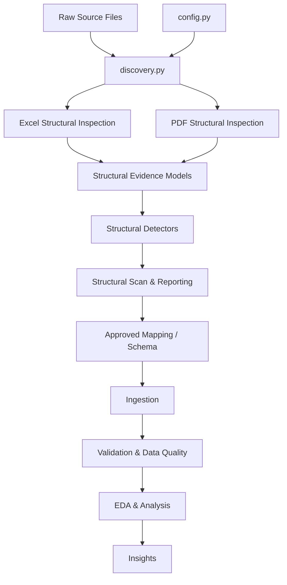

# Egyptian Traffic Registration Data Analysis

A Python-based data engineering and analysis project for Egyptian traffic registration data, focused on building a reproducible workflow for discovering, inspecting, validating, and eventually analyzing heterogeneous traffic data sources.

> **Project status:** Active development — the project is currently focused on establishing a reliable data discovery and structural inspection foundation before downstream ingestion, validation, cleaning, and analysis.

---

## Overview

This project develops a reproducible workflow for working with Egyptian traffic registration data obtained from heterogeneous source files.

The project does not begin by assuming that all source files share the same structure.

Instead, the workflow first establishes what the source files contain and how their structures differ. This includes file-level discovery, structural inspection of Excel and PDF sources, evidence collection, structural detection, and reporting.

The overall objective is to build a controlled path from heterogeneous raw sources to validated analytical data.

### Core principle

```text
Discover → Inspect → Establish Evidence → Map → Ingest → Validate → Analyze
```

The project therefore separates **source discovery and structural understanding** from later data transformation and analysis.

---

# Why This Project?

Real-world data processing often begins with sources that are not immediately ready for analysis.

In this project, the source environment requires the processing workflow to account for structural characteristics such as:

* multiple source files
* Excel sources
* PDF sources
* different source structures
* multiple sheets/pages where applicable
* possible repeated headers
* structural totals and notes
* Arabic and English textual content
* source-level provenance and traceability

The project therefore treats structural inspection as an explicit stage rather than assuming a final tabular schema from the beginning.

> **Important:** The exact characteristics of every source are established through the project's discovery and structural inspection process rather than assumed in advance.

---

# Project Objectives

The project is being developed around the following objectives:

1. Discover and inventory source files without modifying the original sources.
2. Preserve traceability between discovered files and downstream processing.
3. Inspect Excel and PDF structures before attempting final ingestion.
4. Capture structural evidence separately from semantic interpretation.
5. Detect structural candidates such as headers, totals, notes, and other relevant patterns.
6. Establish a controlled basis for schema and ingestion decisions.
7. Validate the resulting data before analysis.
8. Build a reproducible workflow that can be extended as additional reporting periods become available.
9. Produce analytical outputs and insights after the upstream data foundation has been established.

---

# Current Project Architecture

The project is being developed as a staged data-processing workflow.



### Architectural principle

The workflow intentionally separates:

```text
Source Discovery
        ↓
Structural Evidence
        ↓
Interpretation / Mapping
        ↓
Ingestion
        ↓
Validation
        ↓
Analysis
```

This separation is intended to reduce the risk of transforming or cleaning a source before its structure has been sufficiently understood.

---

# Source Code Organization

The reusable project logic is located under:

```text
src/
```

The current source modules are organized around specific responsibilities rather than a single large analysis script.

```text
src/
├── __init__.py
├── config.py
├── cross_file.py
├── discovery.py
├── excel_structural.py
├── grain_detection.py
├── ingestion.py
├── pdf_structural.py
├── period.py
├── profiling.py
├── schema.py
├── structural_detectors.py
├── structural_models.py
├── structural_reports.py
├── structural_scan.py
└── utils.py
```

## Module Responsibilities

| Module                    | Current responsibility                                        |
| ------------------------- | ------------------------------------------------------------- |
| `config.py`               | Project paths, configuration values, and processing contracts |
| `discovery.py`            | File-level discovery and creation of the source file manifest |
| `excel_structural.py`     | Structural inspection of Excel sources                        |
| `pdf_structural.py`       | Structural inspection of PDF sources                          |
| `structural_models.py`    | Storage and representation of structural evidence             |
| `structural_detectors.py` | Detection logic for structural and semantic candidates        |
| `structural_scan.py`      | Structural scanning workflow and coordination                 |
| `structural_reports.py`   | Reporting of structural scan results                          |
| `ingestion.py`            | Data ingestion layer                                          |
| `schema.py`               | Schema-related definitions                                    |
| `grain_detection.py`      | Grain-related detection logic                                 |
| `cross_file.py`           | Cross-file processing/checks                                  |
| `period.py`               | Period-related processing                                     |
| `profiling.py`            | Data profiling functionality                                  |
| `utils.py`                | Shared utility functionality                                  |

### Important architectural distinction

The project does not treat all modules as being at the same maturity level.

Some modules belong to the current structural-processing foundation, while other modules support later ingestion, validation, profiling, or analytical stages.

> **[TODO — FILL THIS IN AFTER SOURCE MODULE AUDIT]**
> For each module, document its current implementation status:
>
> * `Implemented`
> * `Partially implemented`
> * `Foundation / planned integration`
> * `Experimental`
>
> Also document the primary caller/dependent module where applicable.

---

# Structural Processing Foundation

The current implementation establishes a structural-processing foundation before final data transformation.

The main flow is:

```text
config.py
    ↓
discovery.py
    ↓
excel_structural.py / pdf_structural.py
    ↓
structural_models.py
    ↓
structural_detectors.py
    ↓
structural_scan.py
    ↓
structural_reports.py
```

## 1. Configuration

`config.py` centralizes project paths, processing settings, and related configuration contracts.

This provides a common configuration layer instead of scattering paths and processing settings throughout the source code.

---

## 2. File Discovery

`discovery.py` operates at the file level.

Its role is to establish what source files are present before deeper structural processing begins.

The discovery stage is intentionally separated from Excel/PDF content inspection.

The resulting manifest provides a traceable representation of discovered source files.

---

## 3. Excel Structural Inspection

`excel_structural.py` is responsible for inspecting Excel source structure before final ingestion.

The structural inspection is designed to avoid assuming that:

* the first row is necessarily the header
* one sheet represents the entire source
* one fixed layout applies to every file
* the source already conforms to the final analytical schema

The output is structural evidence that can later support mapping and ingestion decisions.

---

## 4. PDF Structural Inspection

`pdf_structural.py` provides structural inspection for PDF sources.

The current design supports structural extraction based on PDF text and coordinates, with OCR available as an optional fallback where required.

The purpose of this stage is to capture source structure and evidence rather than immediately convert the document into a final analytical table.

> **[TODO — FILL THIS IN AFTER PDF STRUCTURAL AUDIT]**
> Document the final supported PDF extraction modes and the exact conditions under which OCR is activated.

---

## 5. Structural Evidence Models

`structural_models.py` provides the data structures used to represent structural evidence.

This creates a separation between:

```text
Evidence
```

and:

```text
Detection / Interpretation
```

The goal is to preserve evidence produced during structural inspection instead of immediately collapsing it into a final schema.

---

## 6. Structural Detection

`structural_detectors.py` contains detection logic used to identify structural candidates.

Depending on the source, this layer can support detection of patterns such as:

* possible headers
* repeated headers
* total rows
* notes/source rows
* empty boundaries
* other structural indicators

The detector output is evidence for later review and mapping rather than an automatic claim that a candidate is the final schema.

---

## 7. Structural Scan and Reporting

`structural_scan.py` coordinates structural scanning.

`structural_reports.py` is responsible for reporting structural scan results.

The resulting artifacts are intended to make structural inspection reviewable and traceable.

> **[TODO — FILL THIS IN AFTER REPORT AUDIT]**
> Document the final list of structural output artifacts and the purpose of each one.

---

# Data Flow and Traceability

A central design goal is to preserve the relationship between downstream processing and the original source.

The intended relationship is:

```text
Source File
    ↓
Discovery Record
    ↓
Structural Evidence
    ↓
Mapping / Schema Decision
    ↓
Ingestion
    ↓
Validated Data
```

Where applicable, processing should retain sufficient source information to allow a result to be traced back to its originating file and source location.

> **[TODO — FILL THIS IN AFTER INGESTION DESIGN]**
> Document the final provenance fields retained in the canonical dataset.

---

# Data Sources

The project works with Egyptian traffic registration data supplied through source files associated with traffic reporting.

The current local development dataset includes a raw monthly source collection.

> **[TODO — FILL THIS IN]**
>
> * Official/source organization name:
> * Exact dataset/report description:
> * Public or restricted source:
> * Source acquisition method:
> * Coverage period:
> * Number of source files per period:
> * Geographic coverage:
> * Vehicle/report categories:
> * Any usage restrictions or citation requirements:

### Data privacy

Raw source data is intentionally kept outside the public Git repository.

The repository therefore contains project code and documentation rather than the private/raw source files.

---

# Project Structure

The repository is intentionally kept relatively small at the root level.

```text
egyptian-traffic-data-analysis/
│
├── .gitignore
├── README.md
├── requirements.txt
│
├── notebooks/
│
└── src/
```

## Why is the root structure intentionally small?

The repository does not add directories simply for visual appearance.

Each directory should correspond to an actual project responsibility and contain meaningful artifacts.

The current separation is:

```text
src/
    Reusable project logic

notebooks/
    Exploratory / workflow-oriented project notebooks

README.md
    Project documentation and architecture

requirements.txt
    Python project dependencies

.gitignore
    Rules preventing private, generated, and environment files
    from being committed
```

### Planned repository expansion

As the corresponding project components become real and contain meaningful artifacts, the repository may expand to include:

```text
tests/
docs/
examples/
```

These directories are **not added merely to make the repository look larger or more professional**.

They should be introduced when their contents and purpose are established.

> **[TODO — FILL THIS IN AFTER PORTFOLIO STRUCTURE REVIEW]**
> Final repository structure after the test/documentation/example layers are implemented.

---

# Notebooks

The project uses notebooks for workflow-oriented and analytical stages.

Current notebook sequence:

```text
notebooks/
├── 01_data_inventory.ipynb
├── 02_data_quality.ipynb
├── 03_data_cleaning.ipynb
├── 04_eda.ipynb
└── 05_insights.ipynb
```

The numbering represents the intended analytical workflow rather than implying that every stage is currently complete.

The current project development is focused on the data inventory and structural understanding foundation.

> **[TODO — FILL THIS IN AFTER NOTEBOOK AUDIT]**
>
> For each notebook, document:
>
> | Notebook                  | Purpose | Current status | Inputs | Outputs |
> | ------------------------- | ------- | -------------- | ------ | ------- |
> | `01_data_inventory.ipynb` | [FILL]  | [FILL]         | [FILL] | [FILL]  |
> | `02_data_quality.ipynb`   | [FILL]  | [FILL]         | [FILL] | [FILL]  |
> | `03_data_cleaning.ipynb`  | [FILL]  | [FILL]         | [FILL] | [FILL]  |
> | `04_eda.ipynb`            | [FILL]  | [FILL]         | [FILL] | [FILL]  |
> | `05_insights.ipynb`       | [FILL]  | [FILL]         | [FILL] | [FILL]  |

---

# Data Inventory and Structural Inspection

The initial data-understanding stage is intentionally separated from cleaning.

The workflow first establishes:

```text
What files exist?
        ↓
What structures do they contain?
        ↓
Where are possible headers?
        ↓
Where are repeated structures?
        ↓
What structural evidence exists?
        ↓
What decisions are required before ingestion?
```

Only after these questions have sufficient evidence should downstream transformation and cleaning be finalized.

---

# Data Quality and Validation

The project is intended to include data-quality and validation stages after the structural and ingestion foundations have been established.

> **[TODO — FILL THIS IN WHEN IMPLEMENTED]**
>
> Document the final validation framework, including:
>
> * schema validation
> * data types
> * completeness
> * uniqueness
> * duplicate detection
> * value constraints
> * cross-field consistency
> * cross-file consistency
> * anomaly handling

---

# Analysis and Insights

The analytical stage will be built on top of the validated data layer.

> **[TODO — FILL THIS IN AFTER ANALYSIS]**
>
> Document:
>
> * analytical questions
> * descriptive statistics
> * EDA
> * temporal analysis
> * geographic analysis
> * vehicle/category analysis
> * major findings
> * visualizations
> * dashboards, if implemented

---

# Technologies

Current project technologies include Python-based data processing and analysis tools.

> **[TODO — FILL THIS IN AFTER REQUIREMENTS AUDIT]**
>
> Final direct project dependencies:
>
> * Python version: [FILL]
> * pandas: [FILL]
> * Excel processing library: [FILL]
> * PDF processing library: [FILL]
> * OCR tooling: [FILL / OPTIONAL]
> * validation tooling: [FILL]
> * visualization tooling: [FILL]
> * testing framework: [FILL]

---

# Reproducibility

The project is designed around a reproducible workflow in which configuration, discovery, structural inspection, ingestion, validation, and analysis are separated into defined stages.

Private/raw data is not committed to the repository.

> **[TODO — FILL THIS IN AFTER REPRODUCIBILITY AUDIT]**
>
> Add the exact clean-machine setup and execution procedure:
>
> 1. Clone repository
> 2. Create virtual environment
> 3. Install dependencies
> 4. Configure local/private data
> 5. Run discovery
> 6. Run structural inspection
> 7. Run ingestion
> 8. Run validation
> 9. Run analysis

---

# Current Status

The project currently has an established project structure and a structural data-processing foundation.

Implemented foundation includes:

* project configuration
* file discovery
* source manifest generation
* Excel structural inspection
* PDF structural inspection
* structural evidence models
* structural detection logic
* structural scanning
* structural reporting
* initial project notebooks
* Git/GitHub repository setup
* protection of private/raw project data through `.gitignore`

The downstream ingestion, validation, data-quality, cleaning, EDA, and insights stages are being developed progressively.

> **[TODO — UPDATE THIS SECTION AFTER EACH MAJOR PROJECT MILESTONE]**

---

# Roadmap

## Phase 1 — Project and Portfolio Foundation

* [x] Establish project structure
* [x] Establish Git repository
* [x] Establish public GitHub repository
* [x] Protect private/raw data from Git tracking
* [ ] Complete portfolio documentation

## Phase 2 — Data Understanding

* [x] File discovery
* [x] Source manifest
* [x] Excel structural inspection
* [x] PDF structural inspection
* [x] Structural evidence models
* [x] Structural detection foundation
* [ ] Complete structural review and mapping

## Phase 3 — Ingestion

* [ ] Finalize source mappings
* [ ] Establish canonical schema
* [ ] Establish canonical grain
* [ ] Implement/complete ingestion
* [ ] Establish provenance model

## Phase 4 — Data Quality

* [ ] Schema validation
* [ ] Completeness checks
* [ ] Uniqueness checks
* [ ] Consistency checks
* [ ] Cross-file validation
* [ ] Data-quality reporting

## Phase 5 — Analysis

* [ ] Data cleaning
* [ ] Exploratory data analysis
* [ ] Descriptive analysis
* [ ] Cross-period analysis
* [ ] Insights
* [ ] Visualizations

## Phase 6 — Engineering Quality

* [ ] Automated tests
* [ ] Synthetic test fixtures
* [ ] Continuous integration
* [ ] Reproducibility documentation
* [ ] Portfolio examples using non-sensitive data

---

# Project Documentation Status

This README intentionally distinguishes between:

* functionality already established
* functionality under development
* information that still requires project-specific confirmation

Items marked:

```text
[TODO — FILL THIS IN]
```

must be completed after the corresponding project component has been audited or implemented.

No unverified dataset characteristics, analytical results, performance claims, or source claims should be added without evidence.

---

# License

> **[TODO — DECIDE BEFORE FINAL PUBLIC RELEASE]**

The repository currently does not declare a project license.

---

# Author

> **[TODO — FILL THIS IN]**
>
> Name:
> GitHub:
> LinkedIn:
> Portfolio:
> Contact:
